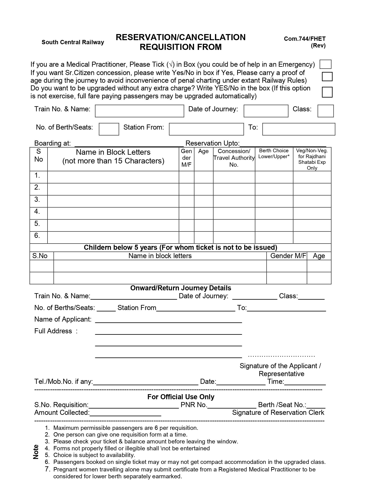
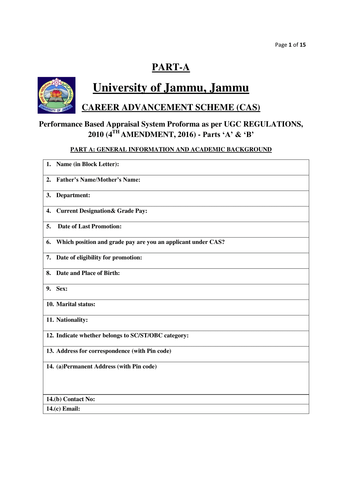
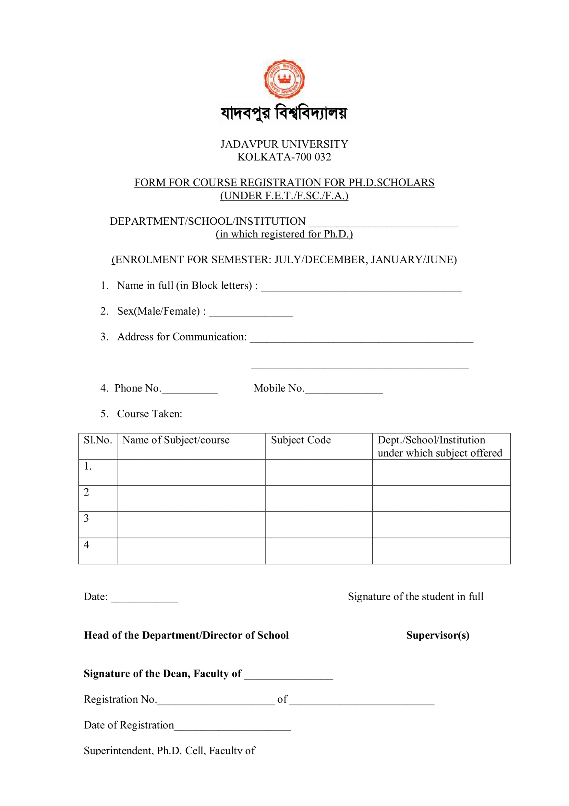
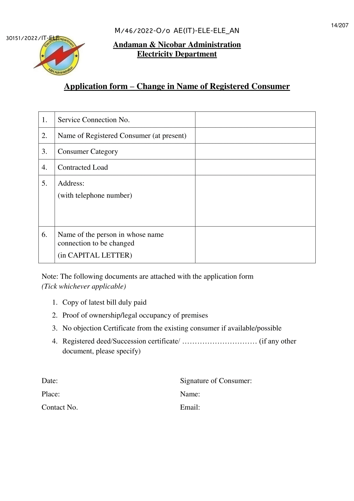

# Handwritten Form Digitization Portal

## Overview
This portal enables the digitization of handwritten forms, currently supporting the following languages:
- English
- Bengali
- Hindi
- Telugu

The system works exclusively with specified form templates and is hosted on the ILOCR server.

## Portal Access
You can access the portal at:  
[ILOCR Form OCR](https://ilocr.iiit.ac.in/formocr/)

### Demo Login Credentials
For demonstration purposes, you can log in using:
- **User ID:** testuser
- **Password:** test@1234

## Features
- Fast and accurate digitization of handwritten forms.
- Multi-language support (English is working fine for now. Other language will be integrated soon!!).
- Designed to work only with predefined form templates.
- Hosted on the **ILOCR server** for reliable performance.

## Supported Templates

### English

## Usage Instructions
1. Visit the [portal URL](https://ilocr.iiit.ac.in/formocr/).
2. Log in using the provided credentials.
3. Upload a supported form template.
4. The system will process and digitize the handwritten content.
5. View and download the extracted text.

## Contact
For any issues or queries, please reach out to me at **shaonbhattacharyya2000@gmail.com**.
